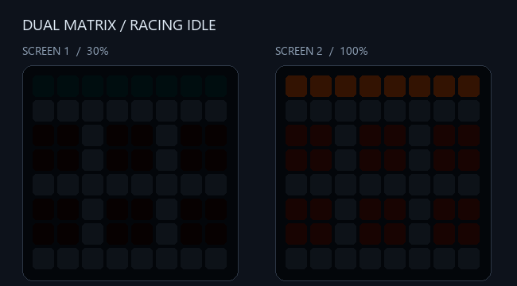
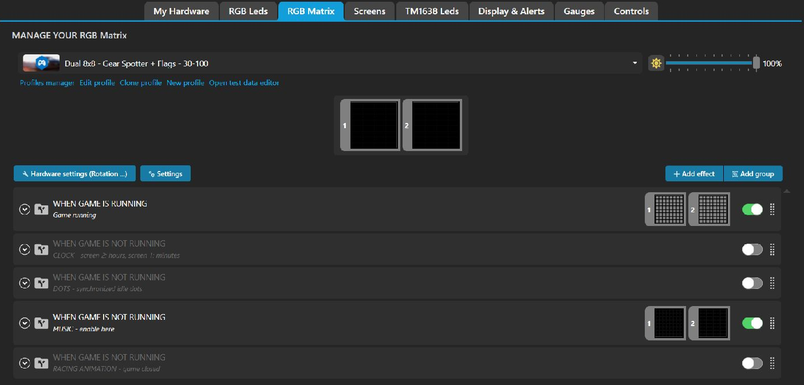
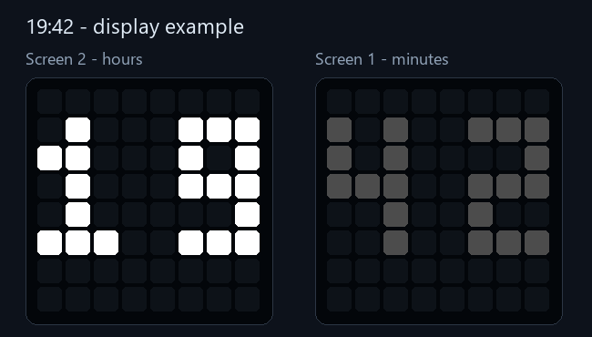
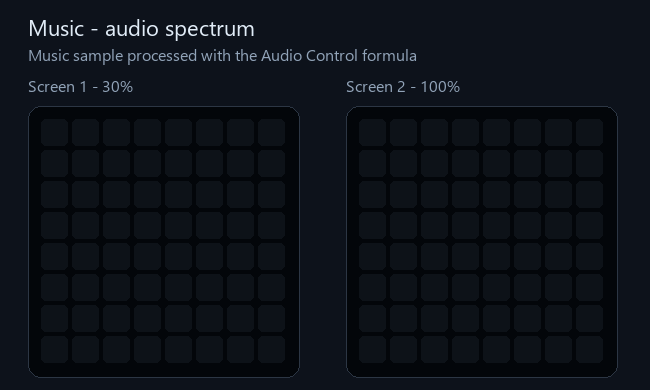
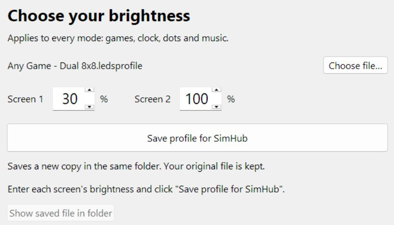

# SimHub Dual 8x8 RGB Matrix Profile

A SimHub LED profile for two 8×8 RGB matrices: gear, spotter warnings and racing flags, with synchronized animations, a clock and an audio spectrum when the game is closed.

**Tested in iRacing by multiple users.** Other games may work through SimHub's shared telemetry properties; their compatibility has not been confirmed.

## Features

- **Screen 1:** gear and left/right spotter warnings.
- **Screen 2:** flags, pit lane and pit limiter indicators.
- **iRacing alerts:** slow car ahead, disqualification, start lights and incidents.
- **Idle modes:** racing animation, 24-hour clock, blinking dots or audio spectrum.
- **Independent brightness:** 30% on screen 1 and 100% on screen 2 by default.

## Requirements

- Windows with SimHub and two 8×8 RGB matrices configured in **Arduino > RGB Matrix** as matrix 1 and matrix 2.
- SimHub's built-in **Audio Control** plugin for music mode.
- Python 3.8 or newer with Tkinter **only for the optional brightness utility**. No additional Python packages are needed.

## Installation

1. [Download the profile and utilities](https://github.com/Lord-of-the-Bots/simhub-dual-8x8-rgb-matrix/archive/refs/heads/main.zip) and extract the ZIP, or use **Code > Download ZIP**.
2. Open your SimHub installation folder.
3. Copy `NCalcScripts/DualMatrixClock.ini` into SimHub's `NCalcScripts` folder. Create the folder if necessary.
4. Restart SimHub.
5. Open **Arduino > RGB Matrix > Profiles manager > Import profile**.
6. Import `Any Game - Dual 8x8.ledsprofile`.
7. Select **Dual 8x8 - Gear Spotter + Flags - 30-100** in the profile list.

The shared clock keeps animations on both screens synchronized. Without it, the profile falls back to the computer clock.

### Updating

Export your current profile first if you have customized it. Import the new profile and accept replacement when prompted. If `DualMatrixClock.ini` is already installed, you do not need to replace it for this version.

## In-game display

| Screen | Display | Default brightness |
| --- | --- | --- |
| 1 | Gear and nearby cars on the left/right | 30% |
| 2 | Flags, pit lane and pit limiter | 100% |

In iRacing, synchronized blinking dots appear when you are outside the car. In other games, they appear when the game reports that it is paused.

Standard flags, pit limiter, pit lane and spotter warnings use shared SimHub properties. Availability depends on the game. Slow-car-ahead, disqualification, start lights and incident alerts use iRacing-specific properties.

## Idle modes

In the profile editor, enable **one** of these top-level entries and disable the other three:

| Profile entry | Display |
| --- | --- |
| `RACING ANIMATION - game closed` | Synchronized racing animation; enabled by default |
| `CLOCK - screen 2: hours, screen 1: minutes` | Local computer time in 24-hour format |
| `DOTS - synchronized idle dots` | Synchronized blinking dots |
| `MUSIC - enable here` | Audio spectrum, with blinking dots during silence |

Keep **Game running** enabled: it controls the gear, flags and racing alerts. All four idle modes operate only while the game is closed.

Example shown in SimHub 9.11.21 with MUSIC enabled. The supplied profile starts with RACING ANIMATION enabled.

### Clock

Screen 2 shows hours; screen 1 shows minutes. At 09:07, screen 2 displays `09` and screen 1 displays `07`.

### Music

1. Enable the built-in **Audio Control** plugin in SimHub settings.
2. Enable **MUSIC - enable here** and disable the other idle modes.
3. Play audio to display spectrum bars on both screens.

Sensitivity adjusts automatically. After one second of continuous silence, the profile switches to the dot animation. Sound returning brings the spectrum bars back automatically. The separate DOTS mode can remain disabled.

The dots are SlateGray, in the top-left corner, with a cycle of one second on and 9.999 seconds off. The cycle keeps running during music, so a dark interval may appear before the dots become visible.

The music preview illustrates the spectrum calculation; it is not a recording of physical panels. Preview audio sample: [Samplelib](https://samplelib.com/sample-wav.html).

## Adjusting brightness

1. Double-click `Adjust brightness.pyw`.
2. Enter a whole number from **0 to 100** for each screen.
3. Click **Save profile for SimHub**.
4. Click **Show saved file in folder**.
5. Import the saved file through **Arduino > RGB Matrix > Profiles manager > Import profile**.

For example, 40% and 80% creates `Dual 8x8 - 40-80.ledsprofile`. The profile name in SimHub also ends in `40-80`.

The utility updates brightness in every mode, including disabled modes. It preserves the source file and creates a new copy on every save. Gear settings, flags, images and mode checkboxes are preserved. **0** turns a screen off; **100** sets full brightness.

To adjust a customized profile, export it from SimHub and select it with **Choose file…**. The utility recognizes this profile's screen brightness groups; changing their names or structure can make an export incompatible.

If double-clicking opens the script as text, open it with Python. The standard Windows Python installer includes Tkinter. Brightness changes take effect after importing the saved profile into SimHub.

## Troubleshooting

- **Idle displays overlap:** enable only one idle mode.
- **Panels show the wrong content:** check matrix 1/2 assignments and panel orientation in SimHub.
- **Animations are out of sync:** check that `DualMatrixClock.ini` is in SimHub's `NCalcScripts` folder, then restart SimHub.
- **Music bars do not appear:** enable Audio Control, select MUSIC and play audio while the game is closed.
- **An alert is missing:** check whether the game supplies the corresponding telemetry. Some alerts are specific to iRacing.

When reporting a problem, include your SimHub version, game, matrix configuration and the affected mode or alert.

## Support development

You can support development with a cryptocurrency donation:

BTC (Bitcoin):
1NbtPNkofnKZRjLpULRjhKuAtbh12DovC9

USDT, TRX (TRC20):
TUgM6hPokF1vPUW8CRp77CgvF3YroabwFP

TON:
UQBLdOWJeVeVg4b0-HkQGNVV8HG6-xWS7moZOUfNBz2-Jf3u

ETH (ERC20):
0x14bba7b8b76ea4743a202bdee2144e4d558ddf93

LTC (Litecoin):
LRRS5YBeqfkYpw2jC2bDAWgpcgm7Wpu6pM
